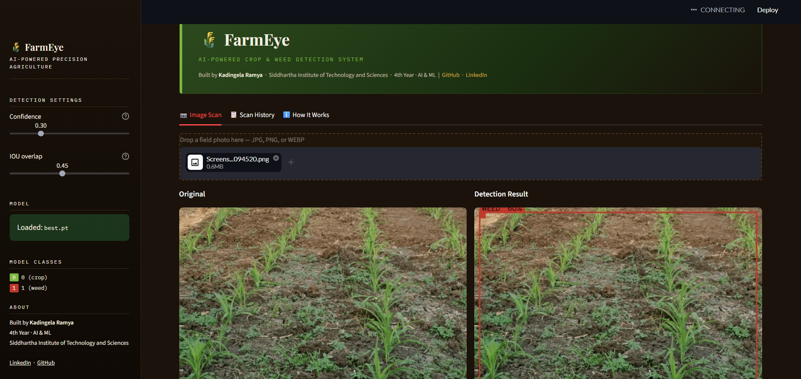
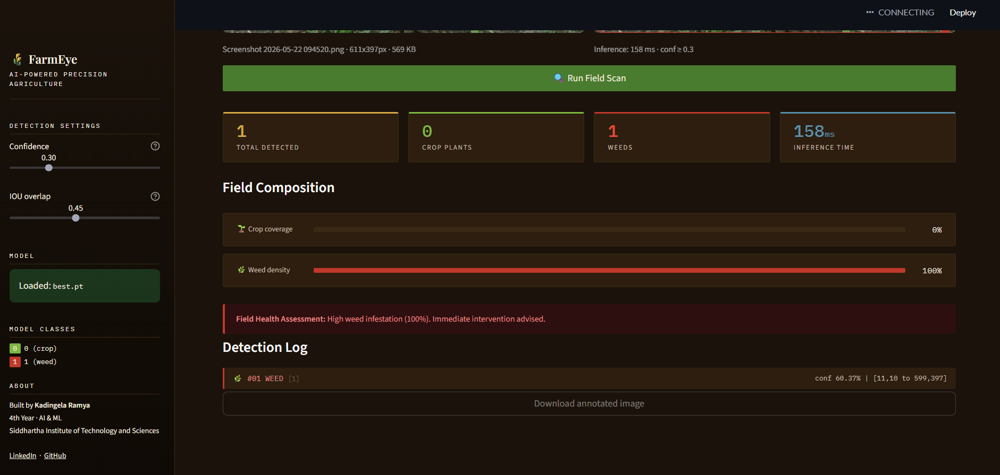

# 🌾 FarmEye — AI-Powered Crop & Weed Detection


---

## What is this?

FarmEye is a computer vision project I built to detect crops and weeds in field images using YOLOv8. Upload a farm photo and the app will draw bounding boxes around detected plants, tell you the weed density, and give a basic field health assessment.

I built this as part of my AI & ML final year to explore how deep learning can be applied to real agricultural problems — specifically the issue of farmers spraying herbicides across entire fields without knowing where weeds actually are.

---


## Demo

### Detection Result


### Field Health Assessment

---

## How to run it locally

```bash
git clone https://github.com/Kadingela-Ramya/farmeye-ai.git
cd farmeye-ai
pip install -r requirements.txt
streamlit run app.py
```

Then open `http://localhost:8501` in your browser and upload any field image.

You'll need the trained `best.pt` file in the same folder. See the Training section below if you want to train your own.

---

## Training the model (Google Colab)

I trained this on Google Colab using a free T4 GPU. The notebook is in the `colab/` folder.

Steps:
1. Open `colab/train_yolov8_crop_weed.ipynb` in Colab
2. Switch runtime to GPU — Runtime → Change runtime type → T4
3. Get a free API key from [roboflow.com](https://roboflow.com)
4. Run all cells — takes around 20-30 minutes
5. Download `best.pt` at the end and place it in the root folder

I used the CropAndWeed dataset from Roboflow with around 2000 annotated field images.

---

## What the app does

- Upload a field image (JPG or PNG)
- Model runs YOLOv8 inference and draws bounding boxes
- Green boxes = crops, Red boxes = weeds
- Shows crop coverage vs weed density as a percentage
- Gives a field health assessment based on weed percentage
- Keeps a session log of all scans
- You can download the annotated image

---

## Tech used

- **YOLOv8** (Ultralytics) for object detection
- **OpenCV** for image processing and drawing boxes
- **Streamlit** for the web interface
- **PyTorch** as the backend framework
- Trained on **Google Colab T4 GPU**

---

## Honest limitations

The model works best on dense canopy field images similar to what it was trained on. It sometimes draws a single large box over the whole field instead of individual plants — this is a training data issue, not a bug in the app. Images taken at crop-row level give better results than bare-soil seedling photos.

If I were to improve this further, I'd retrain on a bigger dataset with tighter annotations and try YOLOv8s or YOLOv8m instead of the nano version for better accuracy.

---

## Project structure

```
farmeye-ai/
├── app.py                  # Main Streamlit app
├── requirements.txt
├── models/
│   └── best.pt             # Trained model weights
├── colab/
│   └── train_yolov8_crop_weed.ipynb
└── assets/
    ├── demo_detection.png
    └── field_health.png
```

---

## About

Built by **Kadingela Ramya** — 4th Year AI & ML Student at Siddhartha Institute of Technology and Sciences

- LinkedIn: [Kadingela Ramya](https://www.linkedin.com/in/ramya-kadingela)
- GitHub: [Kadingela-Ramya](https://github.com/Kadingela-Ramya)

Feel free to open an issue if something doesn't work or if you have questions about the training process.
